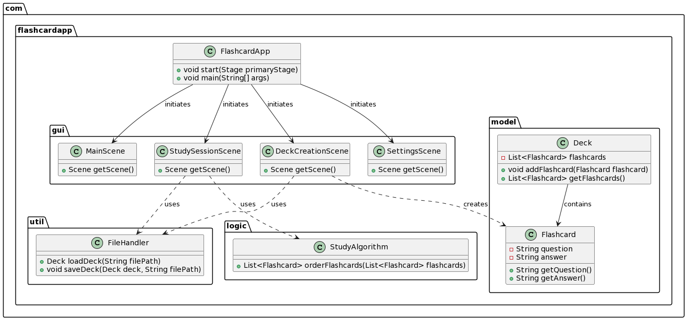

# FlashCardAppFX

A flashcard app using JavaFX. Allows users to create, manage, and study flashcard decks.

# Checklist

- [x] Create a new deck
- [x] Add, modify, and delete cards in a deck
- [x] Study a deck
- [x] Export a deck to a file
- [x] Import a deck from a file
- [ ] Add images to cards
- [ ] Spaced repetition algorithm
- [ ] Dark mode
- [ ] Statistics
- [ ] Save & load user preferences (e.g., theme, last deck studied)

## Prerequisites

Before you begin, ensure you have the following installed:
- JDK 21 or newer
- Git (for cloning the repository)

## Getting Started

First, clone the project repository to your local machine using Git:
```bash
git clone https://github.com/StrugglingDoge/FlashCardAppFX.git
cd project
```
Or, simply download the zip file and extract it to your desired location.

### IntelliJ IDEA

IntelliJ IDEA has built-in support for Gradle projects and should handle most of the setup automatically.

1. **Open IntelliJ IDEA** and select `File > Open...` from the menu.
2. **Navigate to the project directory** you cloned earlier and select the `build.gradle` file. Click `OK`.
3. **Choose "Open as Project"** when prompted.
4. IntelliJ will automatically import the project settings and download the necessary dependencies. This process might take a few minutes.
5. Once the import is complete, you can run the project within IntelliJ.

### Eclipse

Setting up the project in Eclipse requires the Buildship Gradle Integration plugin, which is included in recent versions of Eclipse.

1. **Open Eclipse** and go to `File > Import...`.
2. **Select "Gradle" > "Existing Gradle Project"** and click `Next`.
3. **Choose the project root directory** where you cloned the repository.
4. **Click "Finish"** to start the import process. Eclipse will configure the project based on the `build.gradle` file and download the necessary dependencies.

## Running the Project

After setting up the project in your IDE, you can run it directly from the IDE. Both IntelliJ and Eclipse provide ways to run Gradle tasks directly through their interfaces. Look for the Gradle panel in your IDE to run tasks such as `build` and `run`.

## Troubleshooting

If you encounter any issues while setting up the project, consider the following common fixes:
- Ensure your IDE is using the correct JDK version (JDK 21 or newer).
- Refresh the Gradle project in your IDE. In IntelliJ, use the "Refresh Gradle project" button in the Gradle panel. In Eclipse, right-click the project and choose "Gradle" > "Refresh Gradle Project".
- Check your internet connection to ensure dependencies can be downloaded.

For more specific issues, please consult the IDE's documentation or reach out to the project maintainers.

## UML Diagram
